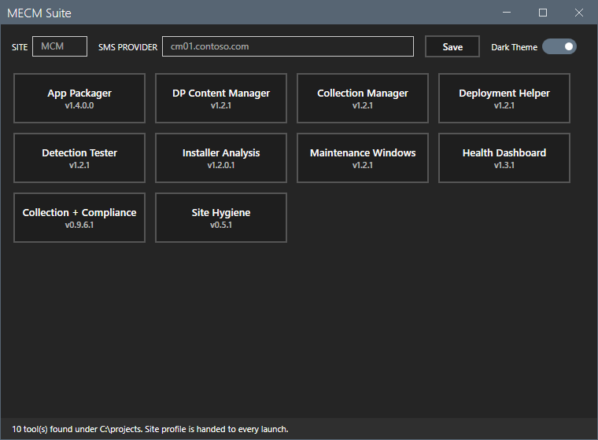

# Suite Core

[](https://github.com/jasonulbright/suite-core/releases/latest)
[](https://github.com/jasonulbright/suite-core/releases)
[](#requirements)
[](LICENSE)

Shared core module (`SuiteCommon`) for a family of MECM (Configuration
Manager) admin tools. Each consumer tool carries a vendored copy at
`Lib\SuiteCommon\` so every tool stays fully standalone — no module
installation, no gallery dependency.

## What SuiteCommon provides

| Area | Functions |
|---|---|
| Logging | `Initialize-Logging` (`-Attach`, `-VerboseLogging`), `Write-Log` (INFO/WARN/ERROR/DEBUG, `-Quiet`), `Write-LogErrorRecord` |
| CM connection | `Connect-CMSite`, `Disconnect-CMSite`, `Test-CMConnection`, `Get-CMConnectionInfo`, `Resolve-ConfigurationManagerModulePath`, `Test-CMSiteCodeMatchesProvider` |
| Settings | `Read-SuiteSettings` (flat defaults merge), `Save-SuiteSettings` |
| Window chrome | `Install-TitleBarDragFallback` (+ the WM_NCHITTEST hook family), `Save-WindowState`, `Restore-WindowState` |
| Theming | `Initialize-SuiteTheme`, `Update-TitleBarBrushes`, `Update-SidebarButtonTheme`, `Set-ButtonTheme`, `Set-DialogTheme` |
| Dialogs | `Show-ThemedMessage`, `Show-ConfirmDialog` |
| Background work | `New-SuiteBgRunspace`, `Stop-SuiteBgWork`, `Close-SuiteBgRunspace` |
| CM widgets | `Build-CollectionTree`, `Show-CollectionPickerDialog` |
| Identity | `Get-SuiteCommonVersion` |

`Connect-CMSite` imports the ConfigurationManager module (from
`SMS_ADMIN_UI_PATH` or known console install paths), creates the site
PSDrive with `-Scope Global` so sibling modules can resolve the CMSite
location, rebuilds a stale drive whose provider connection died, and
verifies the site with `Get-CMSite` (skippable via
`-SkipSiteVerification`). DEBUG console output enables via
`Initialize-Logging -VerboseLogging` or the `SUITE_VERBOSE` environment
variable; a provider machine can be supplied via parameter or
`SUITE_CM_PROVIDER`.

## Launcher



`start-suite.ps1` is a thin WPF shell: one tile per installed suite
tool, discovered as sibling folders of this repository (override the
root in `suite.settings.json`), with each tool's version read from its
CHANGELOG. Every tile launches its tool as a separate process. The
connection profile — site code and SMS provider — is entered once and
handed to each launch through the `SUITE_CM_PROVIDER` /
`SUITE_CM_SITECODE` environment variables; `Connect-CMSite` falls back
to the provider variable, so tools connect without per-tool
configuration. The launcher embeds no tools and hosts no plugins.

## Consuming

A tool module loads its vendored copy once, globally:

```powershell
if (-not (Get-Module SuiteCommon)) {
    Import-Module (Join-Path $PSScriptRoot '..\Lib\SuiteCommon\SuiteCommon.psd1') -Global -DisableNameChecking
}
```

Consumers never edit the vendored copy. Changes land in this repository
and re-vendor via the sync script:

```powershell
.\sync-suitecommon.ps1          # copy current core into consumers
.\sync-suitecommon.ps1 -Check   # report drift, exit 1 if any
```

Drift detection is content-hash based, so both version skew and local
edits to a vendored copy are caught.

## Requirements

- Windows PowerShell 5.1
- Configuration Manager console for the CM connection functions
  (logging and settings work without it)

## License

MIT.
